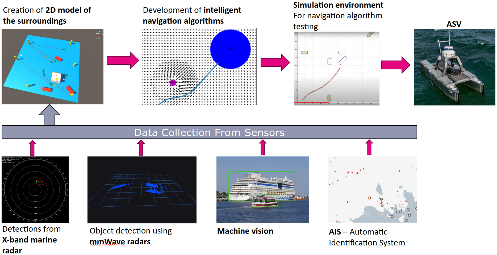

# Testing an Artificial Intelligence Based Navigation Algorithms for Autonomous Robotic Vessels

## Summary
| Company name | [MindChip OÜ](https://mindchip.ee/) |
| :--- | :--- |
| Development Team Lead Name | [Karl Janson](https://www.etis.ee/CV/Karl_Janson/eng/) |
| Development Team Lead E-mail | [karl.janson@taltech.ee](mailto:karl.janson@taltech.ee) |
| Duration of the Demonstration Project | 9 months |
| Final Report | [Example_report.pdf](https://github.com/ai-robotics-estonia/_project_template_/files/13800685/IC-One-Page-Project-Status-Report-10673_PDF.pdf) |

### Each project has an alternative for documentation
1. Fill in the [description](#description) directly in the README below *OR*;
2. make a [custom agreement with the AIRE team](#custom-agreement-with-the-AIRE-team).

# Description
## Objectives of the Demonstration Project
The aim of the project was to develop and test intelligent navigation algorithms that can be used on autonomous robotic vessels.
The project consisted of three main components:
1. Fusion of on-board sensors and mapping of the environment using sensors.
2. Creation and testing of intelligent navigation algorithms.
3. Creation of a simulation environment for easier and safer testing of navigation algorithms.

## Activities and Results of the Demonstration Project
### Challenge
1) Fusion of on-board sensors and mapping of the environment using sensors.
The task was carried out successfully. An ability to generate a map of the environment was implemented. Additionally, the camera image processing systems were upgraded to improve object detection and tracking, which is necessary for including objects detected using cameras in the environment map. The ship already had a YOLOv5-based object detection system (implemented during a previous AIRE project), however, the model was trained mostly on public datasets and not optimized for Estonian environments. In this project, the YOLO network was re-trained on tens of gigabytes of custom data, considerably improving the object detection abilities, especially for region-specific objects, such as buoys, which look different in defferent regions of the world. Additionally, an object tracking system was implemented for cameras using the deepSORT algorithm, which combines classical tracking algorithms (Kalman filters, Hungarian algorithm) with deep learning-based model to actually track the visual features of the object across the frames.

2) Creation and testing of intelligent navigation algorithms.
We started solving the navigation problem with the literature review on suitable algorithms. In the end, we decided to implement a version of simulated potential field algorithm, modified for use on marine navigation (i.e. updated the algorithm to force navigation decisions to follow the marine navigation rules). The algorithm works together with the map of the environment created in point 1 for making intelligent decisions. It works by assigning a simualted electric potential to each object. By simulating the electric fields and following the simple rule that charges with the same sign repel each other, it is possible, in combination with the maps created in point 1 to create an algorithm for making intelligent decisions in rapidly changing environments. The algorithm works in real time and can adapt to new situations it has not been programmed for.

3) Creation of a simulation environment for easier and safer testing of navigation algorithms.
This step involved creating a custom simuation environment, written in Godot4 game engine. The simulation system was programmed with the ship physics and parameters from MindChip’s autonomous ship by taking advantage of the Godot’s  physics engine. The simulator has two modes: it can either be used as a full simulator (e.g for testing the navigation algorithms).
Alternatively, since its simulation portion can be disabled the tool can be used also as a visualization tool for the map created by a real robotic ship in 3D space in real time, to which it can connect over a websocket connection. This was also the main reason we opted for creation of a custom tool instead of using existing simulation environments. The other main reason was that there were no good simulation tools for autonomous ships, so existing simulators like CARLA (which is used in the field of autonomous cars), probably would have required a lot of modification anyway to implement the marine physics.

Since each of the tasks was quite a big task and the project was relatively short, we run out of the time before we managed to fully integrate the components. Therefore, while all the components have been implemented and tested individiually, but we could not fully finish the integration withing the project time, so we could not to test the components together as a single system before the end of the project.

### Data Sources
We used data collected by Mindchip’s ships over the past year:
- Hours of video data recorded with onboard cameras for training and testing the machine vision model
- Minchip’s telemetry data for testing algorithms offline using realistic data
- Ship physical parameters and performance measurements internally collected by Mindchip for the implementing the simulation

### AI Technologies
- Improved model for object detection from camera images (YOLO). Needed for object detection using cameras.
- DeepSORT tracking algorithm. While techinically this task can be solved using non-AI algorithms such as Kalman filers, DeepSORT also takes into account the object’s feature vector while making tracking decisions, therefore allows to also track objects that go behind other objects. This is necessary for navigation in busy harbors.

- The navigation algorithm. While not a neural network-based solution, together with map generation and obstacle detection it forms an ability to make fast adaptive changes in a dynamically changing environment. This makes it a more of a classical-style AI algorithm that allows intelligent and adaptable non-scripted behavior without using neural networks. A dynamically adjusting navigation algorithm such as this is needed for navigating around busy harbors.

### Technological Results
*Please describe the results of testing and validating the technological solution.*

Lorem ipsum dolor sit amet, consectetur adipiscing elit, sed do eiusmod tempor incididunt ut labore et dolore magna aliqua. Ut enim ad minim veniam, quis nostrud exercitation ullamco laboris nisi ut aliquip ex ea commodo consequat. Duis aute irure dolor in reprehenderit in voluptate velit esse cillum dolore eu fugiat nulla pariatur. Excepteur sint occaecat cupidatat non proident, sunt in culpa qui officia deserunt mollit anim id est laborum.

### Technical Architecture
1. Re-trained the YOLO model that was created in the previous AIRE project with custom data (prevously it used data from the web).
Results:
The upgraded model’s performance metrics can be seen in the table below:

| Class  |	Precision |	Recall  | mAP@50 | mAP@50-95 |
|--------|------------|---------|--------|-----------|
| Buoy   |	0.99	  | 0.979   | 0.991  |   	0.867 |
| Vessel |	0.967	  | 0.966   | 0.972  |   	0.889 |
| Port   |	0.979	  | 0.992   | 0.993  |   	0.911 |
 
In general, as seen in the table above, the detection works very well, at least on the test data. It needs to be mentioned that these results were based on tests on data recoreded in daylight with nice weather. In dark or during bad weather the results are expected to be worse, as the training data contained only images recorded during daytime and good weather.

The table below  shows the comparizon to the old model:

<table border="1" cellspacing="0" cellpadding="5">
  <tr>
    <th rowspan="2">Metric</th>
    <th colspan="3">Buoy</th>
    <th colspan="3">Vessel</th>
  </tr>
  <tr>
    <th>Old Model</th>
    <th>New Model</th>
    <th>Improvement (%)</th>
    <th>Old Model</th>
    <th>New Model</th>
    <th>Improvement (%)</th>
  </tr>
  <tr>
    <td>Precision</td>
    <td>0.84</td>
    <td>0.99</td>
    <td>+17.4%</td>
    <td>0.44</td>
    <td>0.97</td>
    <td>+118.3%</td>
  </tr>
  <tr>
    <td>Recall</td>
    <td>0.22</td>
    <td>0.98</td>
    <td>+351.6%</td>
    <td>0.58</td>
    <td>0.97</td>
    <td>+65.4%</td>
  </tr>
  <tr>
    <td>mAP@50</td>
    <td>0.40</td>
    <td>0.99</td>
    <td>+150.3%</td>
    <td>0.49</td>
    <td>0.97</td>
    <td>+98.6%</td>
  </tr>
  <tr>
    <td>mAP@50-95</td>
    <td>0.16</td>
    <td>0.87</td>
    <td>+431.9%</td>
    <td>0.32</td>
    <td>0.89</td>
    <td>+178.7%</td>
  </tr>
</table>

By comparing the upgraded model trained during this project to the pre-existing old model that was trained on data from the internet, it can be seen that the new model works considerably better on the local Estonian dataset. This is expected, as the new model was trained using data collected by Mindchip’s ships in Estonia. This is especially true for the buoy class, which did not perform very well for the old model as bouys differ considerably from place to place. As the dataset for the old model did not contain Estonian buoys, the suboptimal performance was expected. The new model improves the buoy detection capability considerably.
In the comparizon we do not show the Port class, as the old model only had two classes: ship and buoy. The Port class was only added in the new model.

2. Implented deepSORT tracker on top of the YOLO model for tracking objects across multiple frames.
Results: Tracker works as inteded. The tracking accuracy is largely dependent on the underlying YOLO model. In a ideal situation where the objects are constantly in the field of view, the tracing accuracy (i.e. ability to mark the object correctly and assign a correct ID) is close to 100%, assuming the underlying YOLO model can consistently detect the object in each frame. In situations where the YOLO model does not work too well (e.g. in darkness, bad weather, or for ships far away), the tracking accuracy is reduced in correlation with how good is the underlying detection quality. The tracker also seems loose track for far away objects if the waves on the sea are high (the object moves around a lot in the image). This means that some kind of image stabilization mechanism is needed in the future. The tracker can also loose track when the object goes out of the view of the camera for longer time than a couple of seconds.

3. Fusion of on-board sensors and mapping of environment
Results: Since this is a complex task, in this project we only implemented the basic framework. We can read in a map of the environment from a file and update the 2D occupation map in the ship. Adding sensor data to the map is possible in simulated environments, but we did not manage to integrate the actual ship’s sensors with the map due to time limits of the project. However, the framework for adding the sensor data is there.

4. Creation of the simulation environment for testing the navigation algorithms.
Results: A custom simulation environment was created. The tool includes a simplified marine physics simulation and a simulated Mindchip’s catamaran ship. It also includes ability to be controlled by an external application for testing.

5. Creation and testing of intelligent navigation algorithms
Results: An adaptive navigation algorithm that follows the COLREG marine navigation rules was implemented and tested in a virtual environment. We did not have enough time in the project to perform detailed methodical testing on the navigation algorithm. In the simulated tests that we did perform, the algorithm was able avoid collisions with other ships even in heavy traffic, dynamic environments. However, it did produce some „close calls”, indicating that the parameters need further tuning. Also, currently the navigation algorithm cannot dynamically change the ship’s speed, which will be important for the increased safety. In general, the navigation algorithm needs more extensive testing and optimization before it can be trusted to control a real ship in an uncontrolled environment.

### User Interface 
There are multiple ways that the client can see the results. The user interface was shown in the „Challenge addressed” section, below is a short overview:

1. The object detection and tracking can be seen in Mindchip’s control UI, where there is a special setting to enable showing of machine vision detections on the camera images.

2. The navigation algorithm has currently no interface that is accessible to the customer. The customer can see the algorithm at work from how the ship navigates. There is an internal tool for visualizing the internal workings of the algorithm, as shown in the „Challenge addressed” section of this report, but it is not currently made available to the customer at this point. Intergration of this data with the user interface requires additional work that is out of the scope of this project.

3. The generated map can be seen in the simulator developed in this project and also in different third party tools ROS (Robot Operating System) tools like Rviz. The simulator is currently intended for internal use and not available to the customer, but there have been discussions to repurpose the user interface for visualizing 3D space around the ship in the future, which could also be made available to the customer some day. However, this is out of the scope of this project and requires additional development.

### Future Potential of the Technical Solution
1. As mentioned before in this report, the things developed during this project are complex and took a lot of time. We run out of the time in the project before we could fully integrate all the developed systems with Mindchip’s vessels and perform actual tests on real ships. This is probably the next thing that needs to be done in order to verify the correctness and usability of the components developed in this project.

2. While the updated machine vision model works well, it can be further improved with additional data that contains also images recording in different weather conditions.

3. From our tests on the navigation algorithm, it can be said that it works as intended, additional testing and tuning is still required to make sure it is safe for use in real world environments.

4. The visual tracker has some problems with tracking objects in case of high waves on the sea, where the ship and the camera attached to the ship, move a lot. While the tracker can be further tuned, probably also some type of image stabilization solution is needed to fix this.

### Lessons Learned
* Integration can take longer time than expected.
* It is hard to collect usable data for marine environments. In Estonia, especially near smaller harbors where the robotics ships can be safely tested, there is not much traffic to gather images of different ships and buoys, also the small harbors look rather similar. This can result in collecting too much similar data, which can result in overfitting the model on specific types if ships or inflated nubmers during dest on collected data, while the actual real life performance is not always that good as the tests on the dataset would imply.

# Custom agreement with the AIRE team
*If you have a unique project or specific requirements that don't fit neatly into the Docker file or description template options, we welcome custom agreements with our AIRE team. This option allows flexibility in collaborating with us to ensure your project's needs are met effectively.*

*To explore this option, please contact our demonstration projects service manager via katre.eljas@taltech.ee with the subject line "Demonstration Project Custom Agreement Request - [Your Project Name]." In your email, briefly describe your project and your specific documentation or collaboration needs. Our team will promptly respond to initiate a conversation about tailoring a solution that aligns with your project goals.*
